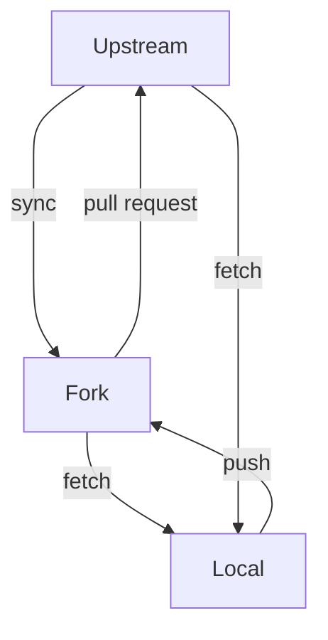

# Repositories

## Fork and Upstream

With an Upstream repository forming the main collaboration area, holding the shared code, issues, etc. 
it can be useful for each contributor to work with a Fork of the Upstream repository.

This enables extensive access to all of the Github tools for each contributor, whilst 
enabling the Upstream repository to remain uncluttered by branches and activity from each contributor.

Interactions between these repositories and the Local working copies of the git repository are shown here:



Note that in this interaction diagram, there is no direct interaction from Local to Upstream.
All to-Upstream interactions are managed through the Fork and Pull Requests.

Indeed, contributors can configure their Local to block all `push` actions to Upstream, through

`git remote set-url --push upstream no_push`

(usefully reinforcing this behaviour, and avoiding mistaken pushes)

### Local remote naming

It can be useful to first Fork the Upstream Repository, then clone to local.  
This leads to the Fork being labelled as origin by default in the Local git repository.

Upstream can then easily be added using

`git remote add upstream <git@{gitUpstream}>`

enabling Local to communicate with upstream and origin.

(Note: it's easy to swap these names after cloning an Upstream with `git remote rm` and `git remote add`)


### Branch Protection

Branch protection rules enable further enforcement of work flows.

https://docs.github.com/en/repositories/configuring-branches-and-merges-in-your-repository/managing-protected-branches/managing-a-branch-protection-rule 


## Local Workflow

A useful and common local work flow at a git terminal is to ensure Local is up to date from Upstream, then create a new branch to work on,
using `upstream/main` as the initialisation point.

```
git fetch upstream
git checkout -b {branchNameForWork} upstream/main
... doWork ...
git commit -am '{message}'
git push origin {branchNameForWork}
```

### Branches

Branches are cheap in git, Local branches in particular, so creating different branches for activities is really useful.

Branches can be tidied up, restructured, rebased, prior to being proposed to Upstream via Pull Requests.

### Forks and Continuous Integration

Forks as fully fledged Github repositories, so any continuous integration that is set up on Upstream can also run in forks.

This can be really useful for contributors who want to ensure that all tests are passing and that a Pull Request is ready for targeting at Upstream.

(Note: keeping `Fork/main` up to date via syncronisation is really useful here

trial Pull Requests targeting `Fork/main` can help get all aspects of a PR into shape prior to submission)
